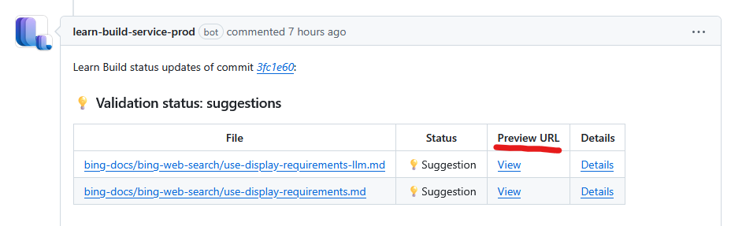

# Bing Docs

This repo holds the [public facing documentation for the Bing APIs](https://learn.microsoft.com/en-us/bing/search-apis/).

## Testing Changes & Staging

You cannot test locally. However, you can preview your changes in a staging environment.
For that, create a PR and, upon successful validation, the changes will be automatically deployed.
Preview URLs appear in a PR comment:

The URL will look similar to:
`https://review.learn.microsoft.com/en-us/bing/search-apis/<some-modified-page>?branch=main&branchFallbackFrom=<pr-en-us-123>`

## Deployment

Merge `main` into `live` and deployment will happen automatically.
It can take up to 45min to see the changes on the web page.

## Microsoft Open Source Code of Conduct

This project has adopted the [Microsoft Open Source Code of Conduct](https://opensource.microsoft.com/codeofconduct/).
For more information see the [Code of Conduct FAQ](https://opensource.microsoft.com/codeofconduct/faq/) or contact [opencode@microsoft.com](mailto:opencode@microsoft.com) with any additional questions or comments.