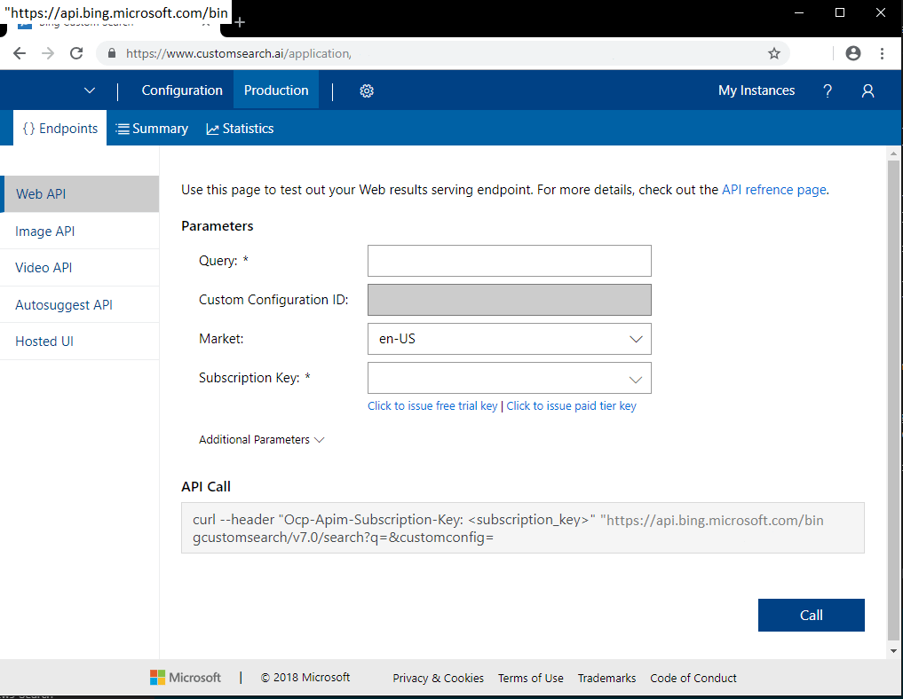

# Test your Bing Custom Search instance from the Portal

After configuring your custom search experience, you can test it from within the [Custom Search portal](https://customsearch.ai).

## Create a search query

Sign into the Custom Search portal, select the search instance to test, and click the **Production** tab. Under **Endpoints**, select an API endpoint (for example, Web API). Your subscription determines what endpoints are shown.

Enter search parameter values. The parameters shown in the portal may change depending on the endpoint you choose.

|Parameter|Description
|-|-
|Query|The search string to search for. Only available for Web, Image, Video, and Autosuggest endpoints.
|Custom Configuration ID|The configuration ID of the selected Custom Search instance. This field is read only.
|Market|The market that results will originate from. Only available for the Web, Image, Video, and Hosted UI endpoints.
|Subscription Key|The subscription key to test with. You can select a key from the dropdown list or enter one manually.

Click **Additional Parameters** to edit the following parameters:  

|Parameter|Description
|-|-
|Safe Search|A filter used to filter webpages for adult content. Only available for the Web, Image, Video, and Hosted UI endpoints. Note that Bing Custom Video Search supports only: `moderate` and `strict`.
|User Interface Language|The language used for user interface strings. For example, if you enable images and videos in Hosted UI, the **Image** and **Video** tabs use the specified language.
|Count|The number of search results to return in the response. Available only for Web, Image, and Video endpoints.
|Offset|The number of search results to skip before returning results. Available only for Web, Image, and Video endpoints.

After specifying all required and optional parameters as appropriate, click **Call** to view the JSON response in the right pane. If you select the Hosted UI endpoint, you can test the search experience in the bottom pane.

## Change your Bing Custom Search subscription

You can change the subscription associated with your Bing Custom Search instance without creating a new instance. To have API calls sent and charged to a new subscription, create a new Bing Custom Search resource in the Azure portal. Use the new subscription key in your API requests, along with your instance's custom configuration ID.

## Next steps

- Learn how to call your instance from a variety of programming languages. See [quickstarts](../quickstarts/quickstarts.md), [samples](../samples.md), and [tutorial](../tutorial/custom-search-web-page.md).
