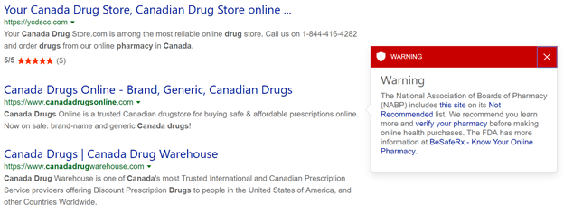

# Handling the response 

> [!NOTE]
> To comply with the new EU Copyright Directive in France, the Bing Web, News, Video, Image and all Custom Search APIs must omit some content from certain EU News sources for French users. The removed content may include thumbnail images and videos, video previews, and snippets which accompany search results from these sources. As a consequence, the Bing APIs may serve fewer results with thumbnail images and videos, video previews, and snippets to French users.


When you send a request to Web Search API, it returns a [SearchResponse](reference/response-objects.md#searchresponse) object in the response body. The object may include one or more of the following answer types:

```json
{
    "_type": "SearchResponse",
    "queryContext": {...},
    "webPages": {...},
    "images": {...},
    "relatedSearches": {...},
    "videos": {...},
    "news": {...},
    "spellSuggestion": {...},
    "computation": {...},
    "timeZone": {...},
    "rankingResponse": {...},
    "entities": {...},
    "places": {...},
    "translations": {...},
}
```

Basically, Bing returns any answer it finds relevant to the user's query, which is typically a subset of the possible answers. But Bing always returns the following answers in each response:

```json
{
    "_type": "SearchResponse",
    "queryContext": {...},
    "rankingResponse": {...}
}
```

But if an error occurs, the response body contains an [ErrorResponse](reference/response-objects.md#errorresponse) object. Bing returns an error response for all 400 level HTTP status codes. [Read more](reference/error-codes.md)

```json
{
  "_type": "ErrorResponse", 
  "errors": [
    {
      "code": "InvalidAuthorization", 
      "subCode": "AuthorizationMissing", 
      "message": "Authorization is required.", 
      "moreDetails": "Subscription key is not recognized."
    }
  ]
}
```

The rest of this topic provides details about each of the answer types in the **SearchResponse** object.

[!INCLUDE [bing-url-note](../../includes/bing-url-note.md)]

## Webpages answer

The [webPages](reference/response-objects.md#webanswer) answer contains a list of links to webpages that Bing determined were relevant to the query. At a minimum, each [webpage](reference/response-objects.md#webpage) in the list includes the page's name, url, display URL, a short description of the content, the date Bing found the content, and the ranking ID.

```json
  "webPages": {
    "webSearchUrl": "https:\/\/www.bing.com\/search?q=mt+rainier",
    "totalEstimatedMatches": 594000,
    "value": [
      {
        "id": "https:\/\/api.cognitive.microsoft.com\/api\/v7\/#WebPages.0",
        "name": "Dinghy sailing",
        "url": "https:\/\/www.bing.com\/cr?IG=3A43CA5...",
        "displayUrl": "https:\/\/en.contoso.com\/wiki\/Dinghy_sailing",
        "snippet": "Dinghy sailing is the activity of sailing small boats...",
        "dateLastCrawled": "2017-04-05T16:25:00"
      },

      . . .
    ]
  }
```

Use `name` and `url` to create a hyperlink that takes the user to the webpage.

The webpage may include a few other fields that you should account for like deep links, a malware notification, and contractual rules.

### Deep links

Deep links are related webpages that Bing found on the webpage’s website. The **Webpage** object in this context includes only the name and url fields and may include the snippet field. 

```json
        "deepLinks": [
          {
            "name": "Drug Product Database Online Query",
            "url": "https:\/\/health-products.canada.ca\/dpd-bdpp\/index-eng.jsp"
          },
          {
            "name": "Access The Extracts",
            "url": "https:\/\/www.canada.ca\/en\/health-canada\/services\/drugs-health-products\/drug-products\/drug-product-database\/extracts.html"
          },
          {
            "name": "Product Monograph Brand Safety Updates",
            "url": "https:\/\/www.canada.ca\/en\/health-canada\/services\/drugs-health-products\/drug-products\/drug-product-database\/label-safety-assessment-update\/product-monograph-brand-safety-updates.html"
          }
        ],
```

Deep links can also have nested deep links.

```json
        "deepLinks": [
          {
            "name": "Webcams",
            "url": "https:\/\/www.nps.gov\/mora\/learn\/photosmultimedia\/webcams.htm",
            "snippet": "See the view from the clouds! Camp Muir perches on the side of Mount Rainier at an elevation of over 10,000 feet (3,000 meters). Updates every 5 minutes. NOTE: Down for repairs for the 2020 season. Thanks for your patience. View Webcam",
            "deepLinks": [
              {
                "name": "Road Status",
                "url": "https:\/\/www.nps.gov\/mora\/planyourvisit\/road-status.htm"
              },
              {
                "name": "Maps",
                "url": "https:\/\/www.nps.gov\/mora\/planyourvisit\/maps.htm"
              },
              {
                "name": "Operating Hours & Seasons",
                "url": "https:\/\/www.nps.gov\/mora\/planyourvisit\/hours.htm"
              },
              {
                "name": "Weather",
                "url": "https:\/\/www.nps.gov\/mora\/planyourvisit\/weather.htm"
              }
            ]
          },
```


### Malware notice

If Bing determines that a webpage may cause a potential issue for the user if they click the link, Bing provides a notice that you should display next to the webpage's link. Potential issues might be that the page contains malware, is a phishing site, or is not recommended for purchasing pharmaceuticals. 

The following image shows how Bing might display the notice for the query, canada drugs. Bing displays the warning when the user hovers over the webpage in the search results page, tabs to it, or touches the webpage on a touch device. 

 

Bing does not let the user click the link or deep links in the search results page. However, the warning does include a link that the user can click to navigate to the webpage if they choose to.

The following example shows what the notice looks like in the JSON response. 

```json
        "malware": {
          "malwareWarningType": "NABP",
          "warningExplanationUrl": "https://verifybeforeyoubuy.org/",
          "warningLetterUrl": "https://www.safe.pharmacy/not-recommended-sites/",
          "beSafeRxUrl": "https://www.fda.gov/Drugs/ResourcesForYou/Consumers/BuyingUsingMedicineSafely/BuyingMedicinesOvertheInternet/BeSafeRxKnowYourOnlinePharmacy/default.htm",
        },
```

If you follow Bing's approach of disabling the webpage's link in the search results, then you'd use the webpage's link in the notice's "visit anyway" link.


### Contractual rules

If a webpage requires attribution, the **Webpage** object includes the `contractualRules` field. For webpages, you typically have to display the license under which the information is provided. The rule could target the webpage as a whole or a specific field of the **Webpage** object. Here's an example that targets the webpage's `snippet` text field.

```JSON
        "contractualRules": [
          {
            "_type": "ContractualRules\/LicenseAttribution",
            "targetPropertyName": "snippet",
            "targetPropertyIndex": 7,
            "mustBeCloseToContent": true,
            "license": {
              "name": "CC-BY-SA",
              "url": "http:\/\/creativecommons.org\/licenses\/by-sa\/3.0\/"
            },
            "licenseNotice": "Text under CC-BY-SA license"
          }
        ],
```

To learn more about attribution, see [Data attribution](data-attribution.md).


## Images answer

The [images](../bing-image-search/reference/response-objects.md#images) answer contains a list of images that Bing thought were relevant to the query. Each [image](../bing-image-search/reference/response-objects.md#image) in the list includes the image's URL, its size, its dimensions, and its encoding format. The **Image** object also includes a thumbnail URL and the thumbnail's dimensions.

```json
  "images": {
    "id": "https:\/\/api.cognitive.microsoft.com\/api\/v7\/#Images",
    "readLink": "https:\/\/api.cognitive.microsoft.com\/api\/v7\/images\/search?q=dinghy+sailing&qpvt=dinghy+sailing",
    "webSearchUrl": "https:\/\/www.bing.com\/images\/search?q=dinghy+sailing&qpvt=lady+gaga",
    "isFamilyFriendly": true,
    "value": [
      {
        "name": "Rich Passage Sailing Dinghy",
        "webSearchUrl": "https:\/\/www.bing.com\/cr?IG=3A43CA5CA64...",
        "thumbnailUrl": "https:\/\/tse1.mm.bing.net\/th?id=OIP....",
        "datePublished": "2011-10-29T11:26:00",
        "contentUrl": "http:\/\/upload.contoso.com\/sailing\/...",
        "hostPageUrl": "http:\/\/www.bing.com\/cr?IG=3A43CA5CA6464....",
        "contentSize": "79239 B",
        "encodingFormat": "jpeg",
        "hostPageDisplayUrl": "http:\/\/en.contoso.com\/wiki\/File...",
        "width": 526,
        "height": 688,
        "thumbnail": {
            "width": 229,
            "height": 300
        },
        "insightsSourcesSummary": {
            "shoppingSourcesCount": 0,
            "recipeSourcesCount": 0
        }
      },

      . . .
    ]
  }
```

The `contentUrl` is the image's URL, the `hostPageUrl` is the URL of the webpage that includes the image, and `thumbnailUrl` is the URL to a thumbnail version of the image in `contentUrl`.
 
Depending on the user's device, you'd typically display a subset of the thumbnails, with an option for the user to see the remaining images.

You can also expand the thumbnail as the user hovers the cursor over it. Be sure to attribute the image if you expand it. For example, by extracting the host from `hostPageDisplayUrl` and displaying it below the image. For information about resizing the thumbnail, see [Resizing and cropping thumbnails](resize-and-crop-thumbnails.md).

If the user clicks the thumbnail, use `webSearchUrl` to take the user to Bing's search results page for images, which contains a collage of the images.

For details about the image answer and images, see [Image Search API](../bing-image-search/overview.md).


## Videos answer

The [videos](../bing-video-search/reference/response-objects.md#videos) answer contains a list of videos that Bing thought were relevant to the query. Each [video](../bing-video-search/reference/response-objects.md#video) in the list includes the video's URL, its duration, its dimensions, and its encoding format. The **Video** object also includes thumbnail URL of the video and the thumbnail's dimensions.

```json
  "videos": {
    "id": "https:\/\/api.cognitive.microsoft.com\/api\/v7\/#Videos",
    "readLink": "https:\/\/api.cognitive.microsoft.com\/api\/v7\/videos\/search?q=dinghy+sailing",
    "webSearchUrl": "https:\/\/www.bing.com\/videos\/search?q=dinghy+sailing",
    "isFamilyFriendly": true,
    "value": [
      {
        "name": "Sailing dinghy",
        "description": "Northwind Traders is a 12 foot gunter rigged...",
        "webSearchUrl": "https:\/\/www.bing.com\/cr?IG=1CAE739681D84...",
        "thumbnailUrl": "https:\/\/tse2.mm.bing.net\/th?id=OVP.wsKiL...",
        "datePublished": "2013-11-06T01:56:28",
        "publisher": [{
            "name": "Fabrikam"
        }],
        "contentUrl": "https:\/\/www.fabrikam.com\/watch?v=MrVBWZpJjX",
        "hostPageUrl": "https:\/\/www.bing.com\/cr?IG=1CAE739681D8400DB...",
        "encodingFormat": "mp4",
        "hostPageDisplayUrl": "https:\/\/www.fabrikam.com\/watch?v=MrBWZpJjXo",
        "width": 1280,
        "height": 720,
        "duration": "PT3M47S",
        "motionThumbnailUrl": "https:\/\/tse2.mm.bing.net\/th?id=OM.oa...",
        "embedHtml": "<iframe width=\"1280\" height=\"720\" src=\"http:\/\/www....><\/iframe>",
        "allowHttpsEmbed": true,
        "viewCount": 19089,
        "thumbnail": {
            "width": 300,
            "height": 168
        },
        "allowMobileEmbed": true,
        "isSuperfresh": false
      },

      . . .
    ]
  }
```

Depending on the user's device, you'd typically display a subset of the videos and provide the user an option to view the remaining videos. You'd display a thumbnail of the video with the video's length, description (name), and attribution (publisher).

As the user hovers over the thumbnail you can use `motionThumbnailUrl` to play a thumbnail version of the video. Be sure to attribute the motion thumbnail when you display it.

If the user clicks the thumbnail, the following are the options for viewing the video:

- Use `hostPageUrl` to view the video on the host website (for example, YouTube)
- Use `webSearchUrl` to view the video in the Bing video browser
- Use `embedHtml` to embed the video in your own experience.

For details about the video answer and videos, see [Video Search API](../bing-video-search/overview.md).


## News answer

The [news](../bing-news-search/reference/response-objects.md#news) answer contains a list of news articles that Bing thought were relevant to the query. Each [news article](../bing-news-search/reference/response-objects.md#newsarticle) in the list includes the article's name, description, and URL to the article on the host's website. If the article contains an image, the object includes a thumbnail of the image.

```json
  "news": {
    "id": "https:\/\/api.cognitive.microsoft.com\/api\/v7\/#News",
    "readLink": "https:\/\/api.cognitive.microsoft.com\/api\/v7\/news\/search?q=dinghy+sailing",
    "value": [
      {
        "contractualRules": [
          {
            "_type": "ContractualRules\/TextAttribution",
            "text": "contoso.com"
          }
        ],
        "name": "WC Sailing Qualifies for America Trophy with...",
        "url": "http:\/\/www.bing.com\/cr?IG=3445EEF15DAF4FFFBF7...",
        "image": {
          "contentUrl": "http:\/\/www.contoso.com\/sports\/sail...",
          "thumbnail": {
            "contentUrl": "https:\/\/www.bing.com\/th?id=ON.1...",
            "width": 400,
            "height": 272
          }
        },
        "description": "The WC sailing team qualified for a...",
        "provider": [
          {
            "_type": "Organization",
            "name": "contoso.com",
            "image": {
              "thumbnail": {
                "contentUrl": "https:\/\/www.bing.com\/th?id=AR_85d7ddac409e7624f6b911ce58ac&pid=news"
              }
            }
          }
        ],
        "datePublished": "2017-04-16T21:56:00",
        "category": "Sports"
      },
    
      ...
    ]
  }
```

If Bing finds a video that's related to the article, it includes the video's URL in the **Video** object.

```json
        "video": {
          "name": "America Trophy qualifiers",
          "motionThumbnailUrl": "https:\/\/wus-streaming-video-msn-com.fabrikam.net\/34572c32-1a0f-4576-...mp4",
          "thumbnail": {
            "width": 640,
            "height": 360
          }
        },
```

Depending on the user's device, you'd display a subset of the news articles with an option for the user to view the remaining articles. Use `name` and `url` to create a hyperlink that takes the user to the news article on the host's site. If the article includes an image, make the image clickable using `url`. 

Be sure to use `contractualRules` to attribute the article. For information about attribution, see [Data attribution](data-attribution.md).

For details about the news answer and news articles, see [News Search API](../bing-news-search/overview.md).


## Related searches answer

The [relatedSearches](reference/response-objects.md#searchresponse-relatedsearches) answer contains a list of the most popular related queries made by other users. Each [query](reference/response-objects.md#query) in the list includes a query string (`text`), a query string with hit highlighting characters (`displayText`), and a URL (`webSearchUrl`) to Bing's search results page for that query.

```json
{
    "text": "dinghy racing teams",
    "displayText": "dinghy racing teams",
    "webSearchUrl": "https:\/\/www.bing.com\/cr?IG=96C4CF214A0..."
}, ...
```

Use the `displayText` query string and the `webSearchUrl` URL to create a hyperlink that takes the user to the Bing search results page for the related query. You could also use the `text` query string in your own Web Search API query and display the results yourself.

For information about how to handle the highlighting markers in `displayText`, see [Hit Highlighting](hit-highlighting.md).

The following shows an example of the related queries usage in Bing.com.


## Computation answer

If the user enters a mathematical expression or a unit conversion query, the response may contain a [Computation](reference/response-objects.md#computation) answer. The `computation` answer contains the normalized expression and its result.

### Unit conversions

A unit conversion query is a query that converts one unit to another. For example, *How many feet in 10 meters?* or *How many tablespoons in a 1/4 cup?*

The following shows the `computation` answer for *How many feet in 10 meters?*

```json
  "computation": {
    "id": "https:\/\/www.bing.com\/api\/v7\/#Computation",
    "expression": "10 meters",
    "value": "32.808399 feet"
  }
```

### Mathematical expression

The following examples show different mathematical expressions and their corresponding `computation` answers.

Expression: (5+3)(10/2)+8

```json
"computation": {
    "id": "https:\/\/www.bing.com\/api\/v7\/#Computation",
    "expression": "((5+3)*(10\/2))+8",
    "value": "48"
}
```

Expression: sqrt(4^2+8^2)

```json
"computation": {
    "id": "https:\/\/www.bing.com\/api\/v7\/#Computation",
    "expression": "sqrt((4^2)+(8^2))",
    "value": "8.94427191"
}
```

Expression: 30 6/8 - 18 8/16

```json
"computation": {
    "id": "https:\/\/www.bing.com\/api\/v7\/#WolframAlpha",
    "expression": "30 6\/8-18 8\/16",
    "value": "12.25"
}
```

Expression: 8^2+11^2-2*8*11*cos(37)

```json
"computation": {
        "id": "https:\/\/www.bing.com\/api\/v7\/#Computation",
        "expression": "(8^2)+(11^2)-(2*8*11*cos(37))",
        "value": "44.4401502"
}
```

A mathematical expression may contain the following symbols:

|Symbol|Description
|-|-
|+|Addition
|-|Subtraction
|/|Division
|*|Multiplication
|^|Power
|!|Factorial
|.|Decimal
|()|Precedence grouping
|[]|Function

A mathematical expression may contain the following constants:

|Symbol|Description
|-|-
|Pi|3.14159...
|Degree|Degree
|i|Imaginary number
|e|e, 2.71828...
|GoldenRatio|Golden ratio, 1.61803...

A mathematical expression may contain the following functions:

|Symbol|Description
|-|-
|Sort|Square root
|Sin[x], Cos[x], Tan[x]<br />Csc[x], Sec[x], Cot[x]|Trigonometric functions (with arguments in radians)
|ArcSin[x], ArcCos[x], ArcTan[x]<br />ArcCsc[x], ArcSec[x], ArcCot[x]|Inverse trigonometric functions (giving results in radians)
|Exp[x], E^x|Exponential function
|Log[x]|Natural logarithm
|Sinh[x], Cosh[x], Tanh[x]<br />Csch[x], Sech[x], Coth[x]|Hyperbolic functions
|ArcSinh[x], ArcCosh[x], ArcTanh[x]<br />ArcCsch[x], ArcSech[x], ArcCoth[x]|Inverse hyperbolic functions

Mathematical expressions that contain variables (for example, 4x+6=18, where x is the variable) are not supported.


## TimeZone answer

If the user enters a time or date query, the response may contain a [TimeZone](reference/response-objects.md#timezone) answer. This answer supports implicit or explicit queries. An implicit query, such as *What time is it?*, returns the local time based on the user's location. An explicit query, such as *What time is it in Seattle?*, returns the local time for Seattle, WA.

Implicit queries, such as *What time zone am I in?*, require the user's location to provide accurate results. Although optional, you should always provide the user’s location using the X-Search-Location and X-MSEdge-ClientIP [headers](reference/headers.md). If you don’t provide the user’s location and Bing thinks the query would benefit from the user's location, it sets the [QueryContext](reference/response-objects.md#querycontext) object’s `askUserForLocation` field to **true**.

```json
  "queryContext": {
    "originalQuery": "what’s the time",
    "askUserForLocation": true
  },
```

The `timeZone` answer provides the name of the location, the current UTC date and time at the specified location, and the UTC offset. If the boundary of the location is within multiple time zones, the answer contains the current UTC date and time of all time zones within the boundary. For example, because Florida State falls within two time zones, the answer contains the local date and time of both time zones.  

If the query requests the time of a state or country/region, Bing determines the primary city within the location's geographical boundary and returns it in the `primaryCityTime` field. If the boundary contains multiple time zones, the remaining time zones are returned in the `otherCityTimes` field.

The following examples show queries that return the `timeZone` answer.

Query: What time is it?

```json
  "timeZone": {
    "id": "https:\/\/www.bing.com\/api\/v7\/#TimeZone",
    "primaryCityTime": {
      "location": "Redmond, Washington, United States",
      "time": "2015-10-27T08:38:12.1189231Z",
      "utcOffset": "UTC-7"
    }
  }
```

Query: What time is it in the Pacific time zone?

```json
  "timeZone": {
    "id": "https:\/\/www.bing.com\/api\/v7\/#TimeZone",
    "primaryCityTime": {
      "location": "Pacific Time Zone",
      "time": "2015-10-23T12:33:19.0728146Z",
      "utcOffset": "UTC-7"
    }
  }
```

Query: Time in Florida?

```json
  "timeZone": {
    "id": "https:\/\/www.bing.com\/api\/v7\/#TimeZone",
    "primaryCityTime": {
      "location": "Tallahassee, Florida, United States",
      "time": "2015-10-23T13:04:56.6774389Z",
      "utcOffset": "UTC-4"
    },
    "otherCityTimes": [
      {
        "location": "Pensacola, Florida, United States",
        "time": "2015-10-23T12:04:56.6664294Z",
        "utcOffset": "UTC-5"
      }
    ]
  }
```

Query: What time is it in the U.S.

```json
  "timeZone": {
    "id": "https:\/\/www.bing.com\/api\/v7\/#TimeZone",
    "primaryCityTime": {
      "location": "Washington, D.C., United States",
      "time": "2015-10-23T15:27:59.8892745Z",
      "utcOffset": "UTC-4"
    },
    "otherCityTimes": [
      {
        "location": "Honolulu",
        "time": "2015-10-23T09:27:59.8892745Z",
        "utcOffset": "UTC-10"
      },
      {
        "location": "Anchorage",
        "time": "2015-10-23T11:27:59.8892745Z",
        "utcOffset": "UTC-8"
      },
      {
        "location": "Phoenix",
        "time": "2015-10-23T12:27:59.8892745Z",
        "utcOffset": "UTC-7"
      },
      {
        "location": "Los Angeles",
        "time": "2015-10-23T12:27:59.8942788Z",
        "utcOffset": "UTC-7"
      },
      {
        "location": "Denver",
        "time": "2015-10-23T13:27:59.8812681Z",
        "utcOffset": "UTC-6"
      },
      {
        "location": "Chicago",
        "time": "2015-10-23T14:27:59.8892745Z",
        "utcOffset": "UTC-5"
      }
    ]
  }
```

This answer also supports determining the difference between time zones or calculating dates such as 90 days from today.

Query: What's the date

```json
  "timeZone": {
    "id": "https://<host>/api/v7/#TimeZone",
    "primaryResponse": "Wednesday, December 11, 2019",
    "description": "Date in Redmond, WA"
  },
```

Query: PST to EST

```json
  "timeZone": {
    "id": "https://<host>/api/v7/#TimeZone",
    "description": "Pacific Standard Time is behind Eastern Standard Time by",
    "timeZoneDifference": {
      "location1": {
        "location": "Pacific Standard Time",
        "time": "2019-12-11T11:54:14.5567693Z",
        "utcOffset": "UTC-8",
        "timeZoneName": "PST"
      },
      "location2": {
        "location": "Eastern Standard Time",
        "time": "2019-12-11T14:54:14.5567693Z",
        "utcOffset": "UTC-5",
        "timeZoneName": "EST"
      },
      "text": "3 hours"
    }
  },
```

Query: 90 days from today

```json
  "timeZone": {
    "id": "https://<host>/api/v7/#TimeZone",
    "date": "Tuesday, March 10, 2020"
  },
```

Query: How may weeks in 2020

```json
  "timeZone": {
    "id": "https://<host>/api/v7/#TimeZone",
    "primaryResponse": "52 weeks and 2 days",
    "description": "There are 52 weeks and 2 days from January 1, 2020 to January 1, 2021"
  },
```

Query: What time zone am I in

```json
  "timeZone": {
    "id": "https://<host>/api/v7/#TimeZone",
    "primaryTimeZone": {
      "location": "Redmond, WA",
      "time": "2019-12-11T11:56:13.6395905Z",
      "utcOffset": "UTC-8",
      "timeZoneName": "Pacific Standard Time"
    }
  },
```


## SpellSuggestion answer

If Bing determines that the user may have intended to search for something different, the response includes a [SpellSuggestions](reference/response-objects.md#spellsuggestions) object. For example, if the user searches for *carlos pen*, Bing may determine that the user likely intended to search for Carlos Pena instead (based on past searches by others of *carlos pen*). The following shows an example spell response.

```json
  "spellSuggestions": {
    "id": "https:\/\/www.bing.com\/api\/v7\/#SpellSuggestions",
    "value": [
      {
        "text": "carlos pena",
        "displayText": "carlos pena"
      }
    ]
  },
```


## QueryContext answer

Each response contains a [QueryContext](reference/response-objects.md#querycontext) object that provides the context that Bing used for the request. At a minimum, the context contains the user’s query string.

```json
  "queryContext": {
    "originalQuery": "mt rainier"
  },
```

If the user's query string contains a spelling mistake, the context includes `alteredQuery` field, with contains the corrected spelling. Bing uses the `alteredQuery` query string in the request instead of the user’s query string. 

```json
"queryContext": {
    "originalQuery": "sialing dingy for sale",
    "alteredQuery": "sailing dinghy for sale",
    "alterationOverrideQuery": "+sialing +dingy for sale"
}
```

The following example shows how Bing uses this information in the UX. If you provide the same feature and the user chooses to use their original query string, use the `alterationOverrideQuery` query string in the request. When encoded, the override string looks like, %2Bsialing+%2Bdingy+for+sale. This forces Bing to use the user’s original string instead of the corrected string.

  

### User location 

Some queries are helped by knowing the user’s location. For example, if the user asks for *today’s weather* or *restaurants near me*, the context object includes the `askUserForLocation` field. If *true*, you should send a new query and include the X-MSEdge-ClientIP and X-Search-Location [headers](reference/headers.md) with the user’s location.

```json
  "queryContext": {
    "originalQuery": "today's weather",
    "askUserForLocation": true
  },
```

## Adult intent

If the user’s query has adult intent, the context includes the `adultIntent` field. If **true**, the user’s [safeSearch](reference/query-parameters.md#safesearch) setting determines the content that Bing returns.

```json
  "queryContext": {
    "originalQuery": "xxx movies",
    "adultIntent": true
  },
```


## RankingResponse answer

Each Bing response contains a [RankingResponse](reference/response-objects.md/rankingresponse) object that suggests the order in which you should display the Bing answers and the results within each answer. For information about how to use the **RankingResponse** object, see [Using ranking to display search results](rank-results.md).

The following example shows parts of the ranking response answer for brevity.

```json
  "rankingResponse": {
    "mainline": {
      "items": [
        {
          "answerType": "Videos",
          "value": {
            "id": "https:\/\/<host>\/api\/v7\/#Videos"
          }
        },
        {
          "answerType": "News",
          "value": {
            "id": "https:\/\/<host>\/api\/v7\/#News"
          }
        },
        {
          "answerType": "WebPages",
          "resultIndex": 0,
          "value": {
            "id": "https:\/\/<host>\/api\/v7\/#WebPages.0"
          }
        },

        . . .

        {
          "answerType": "RelatedSearches",
          "value": {
            "id": "https:\/\/<host>\/api\/v7\/#RelatedSearches"
          }
        }
      ]
    },
    "sidebar": {
      "items": [
        {
          "answerType": "Images",
          "value": {
            "id": "https:\/\/<host>\/api\/v7\/#Images"
          }
        },
        {
          "answerType": "Entities",
          "resultIndex": 0,
          "value": {
            "id": "https:\/\/<host>\/api\/v7\/#Entities.0"
          }
        }
      ]
    }
  }

```


## Translations answer

The [Translations](reference/response-objects.md#webanswer) answer contains the translation of a word or phrase from one language to another. The context used in the translation comes from the query string and other signals. For example, in the query, *amigo in english*, Spanish is inferred from Amigo. If the query string doesn’t explicitly specify the language to translate the text into (for example, if the query is *bon appetit*), Bing infers the language from the browser’s language setting.

The `originalText` field contains the word or phrase to translate and `translatedText` contains the translated text. If the translation request cannot be satisfied within system-defined thresholds, the `translatedText` field is set to "…". If this occurs, you shouldn’t display the answer.

```json
  "translations": {
    "id": "https:\/\/<host\/api\/v7\/#Translations",
    "contractualRules": [
      {
        "_type": "ContractualRules\/LinkAttribution",
        "text": "Microsoft Translator",
        "url": "http:\/\/www.bing.com\/translator\/?ref=TThis&text=hello&from=en&to=es"
      }
    ],
    "attributions": [
      {
        "providerDisplayName": "Microsoft Translator",
        "seeMoreUrl": "http:\/\/www.bing.com\/translator\/?ref=TThis&text=hello&from=en&to=es"
      }
    ],
    "originalText": "hello",
    "translatedText": "Hola",
    "translatedLanguageName": "es",
    "inLanguage": "en"
  },
```

Be sure to use `contractualRules` to attribute the article. For information about attribution, see [Data attribution](data-attribution.md).


## Entities answer

The [entities](../bing-entities-search/reference/response-objects.md#entityanswer) answer contains a list of entity objects that Bing thought were relevant to the query. Each [entity](../bing-entity-search/reference/response-objects.md#entity) in the list identifies a person, place, or thing. Bing returns well-known entities only. Well-known people may include singers, actors, athletes, models, and others. Places refers to well-known tourist attractions, organizations, and localities such as a cities, states, countries, and regions. Things cover everything else not covered by places and people, such as animals, foods, drinks, books, songs, movies, and more. For information about places such as restaurants, hotels, or other local businesses, see the [Places answer](#places-answer). 

### Dominant entity versus disambiguation entities

The list of entities may contain a single dominant entity, multiple disambiguation entities, or both. The following example fragments show the different entity types. See the `entityScenario` field.

**Dominant-only entity** (query is Seattle)

```json
  "entities": {
    "value": [
      {
        "name": "Seattle",
        "entityPresentationInfo": {
          "entityScenario": "DominantEntity",
          "entityTypeHints": [
            "City"
          ]
        },
      }
    ]
  },
```

**Dominant and disambiguation entities** (query is Mt Rainier)

```json
  "entities": {
    "value": [
      {
        "id": "https://<host>/api/v7/#Entities.0",
        "name": "Mount Rainier",
        "entityPresentationInfo": {
          "entityScenario": "DominantEntity",
          "entityTypeHints": [
            "Place"
          ]
        },
      },
      {
        "id": "https://<host>/api/v7/#Entities.1",
        "name": "Mount Rainier National Park",
        "entityPresentationInfo": {
          "entityScenario": "DisambiguationItem"
        },
      }
    ]
  },
```

**Disambiguation-only entities** (query is Washington)

```json
  "entities": {
    "value": [
      {
        "id": "https://<host>/api/v7/#Entities.0",
        "name": "Washington, D.C.",
        "entityPresentationInfo": {
          "entityScenario": "DisambiguationItem",
          "entityTypeHints": [
            "City"
          ]
        },
      },
      {
        "id": "https://<host>/api/v7/#Entities.1",
        "name": "The Washington Post",
        "entityPresentationInfo": {
          "entityScenario": "DisambiguationItem",
          "entityTypeHints": [
            "Organization"
          ]
        },
      },
      {
        "id": "https://<host>/api/v7/#Entities.2",
        "name": "Washington",
        "entityPresentationInfo": {
          "entityScenario": "DisambiguationItem",
          "entityTypeHints": [
            "State"
          ]
        },
      }
    ]
  },
```

Bing returns a dominant entity when there is no ambiguity as to which entity satisfies the request. If multiple entities could satisfy the request, the list contains more than one disambiguation entities. For example, if the request uses the generic title of a movie franchise, the list likely contains disambiguation entities. But, if the request specifies a specific title from the franchise, the list likely contains a single dominant entity.

The [EntityPresentationInfo](../bing-entity-search/reference/response-objects.md#entitypresentationinfo) object contains information that tells you whether the entity is a dominant entity or a disambiguation entity (see the `entityScenario` field). The object may also include one or more hints (see the `entityTypeHints` field) that tell you the entity’s type. The list of hints could contain a single hint such as Movie or a list of hints such as Place, LocalBusiness, Restaurant. Each successive hint in the array narrows the entity's type. But not all entities include type hints.

If the list contains one or more disambiguation entities (the `entityScenario` field is set to DisambiguationItem), consider displaying a list of entities and letting the user select the one they’re interested in. The **Entity** object’s `name` field contains the entity’s name. Use the name along with the URL in the `url` field, if it exists, or the `webSearchUrl` field to create a hyperlink. The entity includes the `url` field only if Bing found a website or webpage for the entity. The URL in the `webSearchUrl` field takes the user to Bing’s search result page for the entity. 

The following answer shows what the JSON response looks like for the query, *mt rainier*. Most entities include the entity’s name, short description, contractual rules, and URL to Bing’s search results page where the user can get more information about the entity. The optional fields that not all entities include are the `image`, `url`, and `entityTypeHints` fields. 

```json
{
  "_type": "SearchResponse",
  "instrumentation": {...},
  "queryContext": {
    "originalQuery": "mt rainier"
  },
  "entities": {
    "value": [
      {
        "id": "https://<host>/api/v7/#Entities.0",
        "contractualRules": [
          {
            "_type": "ContractualRules/LicenseAttribution",
            "targetPropertyName": "description",
            "mustBeCloseToContent": true,
            "license": {
              "name": "CC-BY-SA",
              "url": "http://creativecommons.org/licenses/by-sa/3.0/"
            },
            "licenseNotice": "Text under CC-BY-SA license"
          },
          {
            "_type": "ContractualRules/LinkAttribution",
            "targetPropertyName": "description",
            "mustBeCloseToContent": true,
            "text": "Wikipedia",
            "url": "http://en.wikipedia.org/wiki/Mount_Rainier"
          },
          {
            "_type": "ContractualRules/MediaAttribution",
            "targetPropertyName": "image",
            "mustBeCloseToContent": true,
            "url": "http://en.wikipedia.org/wiki/Mount_Rainier"
          }
        ],
        "webSearchUrl": "https://www.bing.com/entityexplore?q=Mount+Rainier...",
        "name": "Mount Rainier",
        "image": {
          "name": "Mount Rainier",
          "thumbnailUrl": "https://www.bing.com/th?id=AMMS_65523b5b...",
          "provider": [
            {
              "_type": "Organization",
              "url": "http://en.wikipedia.org/wiki/Mount_Rainier"
            }
          ],
          "hostPageUrl": "http://upload.wikimedia.org/commons/Mount_Rainier...",
          "width": 110,
          "height": 110,
          "sourceWidth": 474,
          "sourceHeight": 316
        },
        "description": "Mount Rainier, also known as Tahoma or Tacoma, is a large active strato...",
        "entityPresentationInfo": {
          "entityScenario": "DominantEntity",
          "entityTypeHints": [
            "Place"
          ]
        },
        "bingId": "9ae3e6ca-81ea-6fa1-ffa0-42e1d7890906"
      },
      {
        "id": "https://<host>/api/v7/#Entities.1",
        "contractualRules": [
          {
            "_type": "ContractualRules/MediaAttribution",
            "targetPropertyName": "image",
            "mustBeCloseToContent": true,
            "url": "http://en.wikipedia.org/wiki/Mount_Rainier_National_Park"
          }
        ],
        "webSearchUrl": "https://www.bing.com/entityexplore?q=Mount+Rainier+Nat...",
        "name": "Mount Rainier National Park",
        "url": "https://www.nps.gov/mora/index.htm",
        "image": {
          "name": "Mount Rainier National Park",
          "thumbnailUrl": "https://www.bing.com/th?id=AMMS_4bd2812676c04d54ef0e...",
          "provider": [
            {
              "_type": "Organization",
              "url": "http://en.wikipedia.org/wiki/Mount_Rainier_National_Park"
            }
          ],
          "hostPageUrl": "http://upload.wikimedia.org/Mount_Rainier_7437.JPG",
          "width": 72,
          "height": 72,
          "sourceWidth": 474,
          "sourceHeight": 355
        },
        "description": "Mount Rainier National Park is an American national park located in southeast...",
        "entityPresentationInfo": {
          "entityScenario": "DisambiguationItem"
        },
        "bingId": "9a8a1f72-a577-9f45-e275-1d969576f069"
      }
    ]
  },
```

### Entity attribution

Entities may include the `contractualRules` field, which contains one or more attributions that you must apply to the entity. Not all entities include rules. If the entity provides contractual rules, you must abide by them. The following show what the rules look like in the JSON response. (The example does not show the TextAttribution rule.)

Entity information typically comes from third parties. You are responsible for ensuring that your use is appropriate; for example, by complying with any creative commons license your user experience relies on.

For information about applying attribution, see [Data Attribution](data-attribution.md).


## Places answer

The [places](../bing-entities-search/reference/response-objects.md#localentityanswer) answer contains a list of local business entity objects that Bing thought were relevant to the query. Bing returns this answer only when the query specifies the name of a local business or asks for a type of business (for example, *restaurants near me* or *microsoft store gas near me*). Each [place](../bing-entity-search/reference/response-objects.md#entity) in the list identifies a restaurant, hotel, or other local business.

> [!NOTE]
> The Places answer supports only US Business locations. 
 
> [!NOTE]
> You, or a third party on your behalf, may not use, retain, store, cache, share, or distribute any data from the Places answer for the purpose of testing, developing, training, distributing or making available any non-Microsoft service or feature.

Local aware queries such as *restaurant near me* require the user's location to provide accurate results. Although optional, you should always provide the user’s location using the X-Search-Location and X-MSEdge-ClientIP [headers](reference/headers.md). The X-Search-Location header uses the user’s geographical coordinates (latitude and longitude). 

```
X-Search-Location: lat:47.806897;long:-122.221304;re:30
```

If you don’t provide the user’s location and Bing thinks the query would benefit from the user's location, it sets the `askUserForLocation` field of [QueryContext](reference/response-objects.md#querycontext) to **true**.

```json
  "queryContext": {
    "originalQuery": "italian restaurants near me",
    "askUserForLocation": true
  },
```

The [EntityPresentationInfo](../bing-entity-search/reference/response-objects.md#entitypresentationinfo) object contains hints that identify the local entity's type. The list contains a list of hints such as Place, LocalBusiness, Restaurant. Each successive hint in the array narrows the entity's type. 

```json
        "entityPresentationInfo": {
          "entityScenario": "ListItem",
          "entityTypeHints": [
            "Place",
            "LocalBusiness",
            "Restaurant"
          ]
        },
```

The local entity includes the place's name, address, and telephone number. If the URL to the place’s website is known, the entity includes it, too. When you display the entity information, use the URL in the `webSearchUrl` field to create link that takes the user to Bing’s search results page for the entity.

The following example shows what the JSON response looks like for the query, *coffee near me*. 

```json
  "places": {
    "value": [
      {
        "_type": "Restaurant",
        "id": "https://<host>/api/v7/#Places.0",
        "webSearchUrl": "https://www.bing.com/entityexplore?q=Fourth+Coffee...",
        "name": "Fourth Coffee",
        "url": "http://www.fourthcoffee.com/",
        "entityPresentationInfo": {
          "entityScenario": "ListItem",
          "entityTypeHints": [
            "Place",
            "LocalBusiness",
            "Restaurant"
          ]
        },
        "address": {
          "addressLocality": "Bothell",
          "addressRegion": "WA",
          "postalCode": "98021",
          "addressCountry": "US",
          "neighborhood": "Bothell"
        },
        "telephone": "(425) 555-1234"
      },

      . . .
    
    ]
  },
```

Note that the address’ `neighborhood` field may contain an empty string.

Note that the `_type` field identifies the local entity object's type. The above example shows the object's type as Restaurant. Others object types include Hotel and LocalBusiness.


## Next steps  

- Learn about [use and display requirements](use-display-requirements.md) for displaying Bing Web Search results.  
- Learn about how to use the `RankingResponse` object to [order the search results](rank-results.md) in your UX.
- Learn about the [JSON objects](reference/response-objects.md) found in the response.  
- Learn about the [hit highlighting characters](hit-highlighting.md) found in the search results.
- Learn how to [page webpage results](page-results.md).
